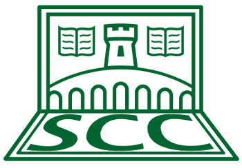

## What is Stirling Coding Club (SCC)?

 

- Part continuation of semina[r] series
- Informal club to share skills & ideas in coding, statistics, mathematics, and workflow
- Friendly learning and teaching 
- **Everyone is welcome**

## Face-to-face and online meetings

  

- Fortnightly meetings on specific topics (WED at noon)
- Fortnightly open meetings for help and discussion (WED at noon)
- Online help and sharing using [GitHub](https://github.com/StirlingCodingClub) discussion issues

**Email to join on GitHub** (free to sign up):

- Brad Duthie: **< alexander.duthie@stir.ac.uk >** 
- Anna Deasey: **< a.l.deasey@stir.ac.uk >**

